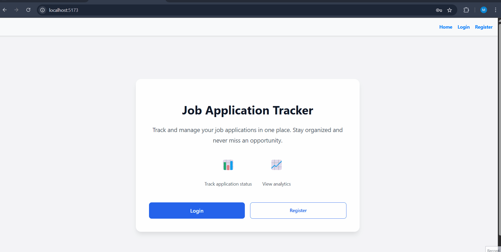

# Job Application Tracker

A modern, full-stack web application for tracking and managing job applications throughout your job search process. 

## Demo
Here is the Demo of how application works



## Features

### Application Management
- Track job applications with detailed information
- Record company names, positions, application status, and job URLs
- Update application status as you progress through interviews
- Sort and filter applications by various criteria
- Pagination for better performance with large datasets

### Dashboard Analytics
- Visual statistics of your job search progress
- Track success rates and application outcomes
- Monitor interview conversion rates
- View application distribution by status

### User Experience
- Responsive design for all devices
- Command palette for quick navigation (⌘/Ctrl + K)
- Real-time search and filtering
- Intuitive date range filtering

### Security
- User authentication and authorization
- Secure password handling
- Protected API endpoints
- Session management

## Tech Stack

### Frontend
- React 18
- React Router for navigation
- Recharts for data visualization
- Heroicons for icons
- Command palette using CMDK

### Backend
- Flask web framework
- PostgreSQL database
- SQLAlchemy ORM
- Flask-Login for authentication
- Flask-CORS for cross-origin support

## Getting Started

### Prerequisites
- Node.js (v16 or higher)
- Python 3.8+
- PostgreSQL

### Installation

1. Clone the repository:
   ```bash
   git clone https://github.com/yourusername/job-application-tracker.git
   cd job-application-tracker
   ```

2. Install frontend dependencies:
   ```bash
   npm install
   ```

3. Install backend dependencies:
   ```bash
   pip install -r requirements.txt
   ```

4. Set up environment variables:
   Create a `.env` file in the root directory:
   ```
   DB_HOST=your_db_host
   DB_NAME=your_db_name
   DB_USER=your_db_user
   DB_PASSWORD=your_db_password
   ```

5. Initialize the database:
   ```bash
   flask db upgrade
   ```

### Running the Application

1. Start the backend server:
   ```bash
   python run.py
   ```

2. Start the frontend development server:
   ```bash
   npm run dev
   ```

3. Open [http://localhost:5173](http://localhost:5173) in your browser

## Usage

### Managing Applications

1. **Adding Applications**
   - Click "Add Application" on the dashboard
   - Fill in company name, position, and optional job URL
   - Select initial application status

2. **Updating Status**
   - Find the application in the table
   - Click "Edit"
   - Update the status and other details
   - Click "Save"

3. **Filtering and Sorting**
   - Use the search bar for quick lookups
   - Filter by status using the dropdown
   - Select date ranges to narrow results
   - Click column headers or use sort controls

### Using the Command Palette
- Press ⌘/Ctrl + K to open
- Quick access to common actions
- Keyboard navigation support

## Contributing

1. Fork the repository
2. Create your feature branch (`git checkout -b feature/AmazingFeature`)
3. Commit your changes (`git commit -m 'Add some AmazingFeature'`)
4. Push to the branch (`git push origin feature/AmazingFeature`)
5. Open a Pull Request

## License

This project is licensed under the MIT License - see the [LICENSE](LICENSE) file for details.

## Acknowledgments

- [React](https://reactjs.org/)
- [Flask](https://flask.palletsprojects.com/)
- [Recharts](https://recharts.org/)
- [CMDK](https://cmdk.paco.me/)
